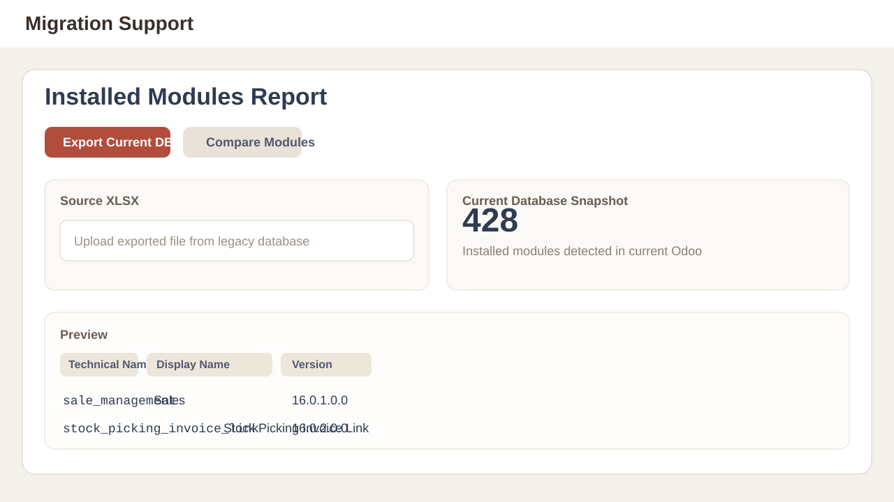
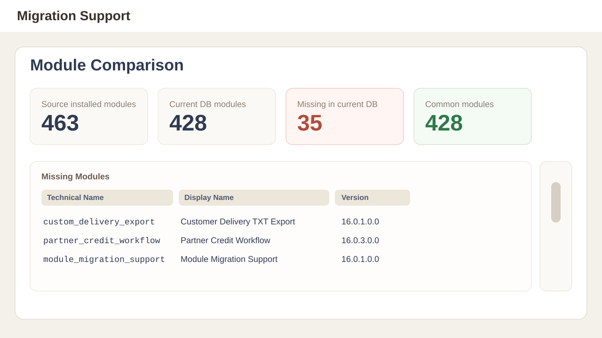
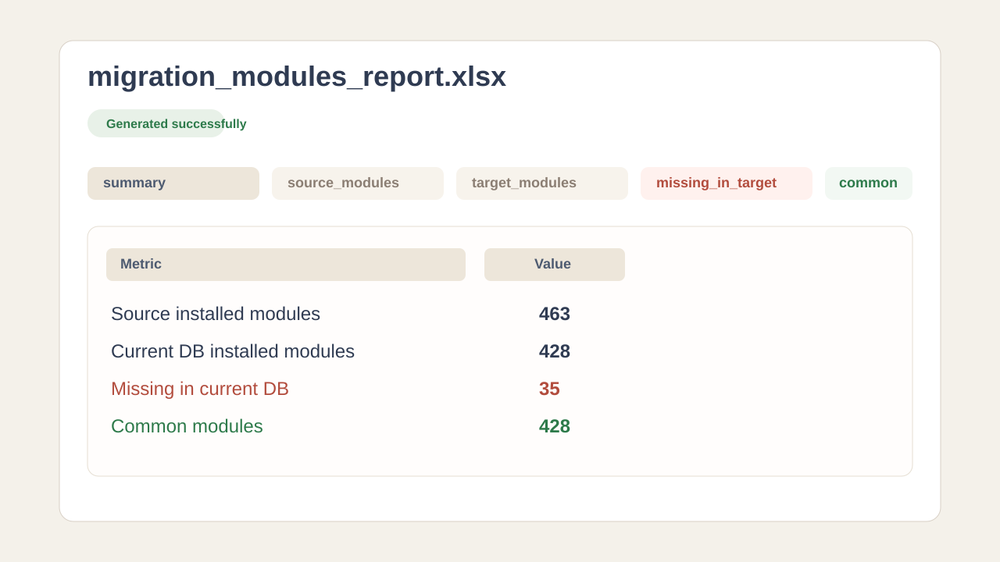

# Module Migration Support

## Purpose

`Module Migration Support` is an Odoo application created to support version migration projects.

It allows you to:

- export the list of installed modules from the current database to an Excel file;
- import an Excel file generated from a legacy database;
- compare modules from the legacy database with the modules installed in the current database;
- identify which modules are still missing in the newer Odoo version.

The application is not designed to execute the migration itself. Its purpose is to provide a reliable report for technical analysis and migration project tracking.

## Visual overview

### Current database export screen

### Source vs target comparison screen

### Example of the generated final report

## How the application works

The module creates a menu called `Migration Support` in Odoo.

Inside this menu there is a screen called `Installed Modules Report`. Each record on that screen represents one migration analysis.

The workflow is based on two steps:

1. generate the Excel file from the current database;
2. compare the current database with an Excel file generated from the legacy database.

## Recommended workflow

### 1. Export modules from the legacy database

Install the module in the legacy database and open:

`Migration Support > Installed Modules Report`

Then:

1. create a new record;
2. click `Export Current DB`;
3. download the generated file using `Download Export`.

This Excel file becomes the snapshot of the installed modules in the legacy version.

## 2. Compare with the new database

In the new database, with the same module installed:

1. open `Migration Support > Installed Modules Report`;
2. create a new record;
3. upload the exported legacy file in the `Source XLSX` field;
4. click `Compare Modules`;
5. download the final report using `Download Report`.

After the comparison, the record itself will display:

- the number of modules found in the source file;
- the number of modules installed in the current database;
- the number of missing modules;
- the number of common modules;
- the detailed list of missing modules.

## Exported Excel structure

The Excel file generated by `Export Current DB` contains a sheet named `modules`.

Each row represents one installed module in the current database.

The exported columns are:

- `name`: technical module name;
- `display_name`: functional module name;
- `installed_version`: version installed in the database;
- `latest_version`: latest version known by Odoo in that database;
- `author`: module author;
- `category`: functional category;
- `application`: indicates whether the module is marked as an application;
- `auto_install`: indicates whether the module is auto-installable;
- `state`: current module state.

## Comparison Excel structure

The final comparison file contains multiple sheets:

### `summary`

Provides an executive summary of the comparison.

Main fields:

- `Source installed modules`: total number of modules found in the legacy file;
- `Current DB installed modules`: total number of installed modules in the current database;
- `Missing in current DB`: total number of source modules that are not installed in the new database;
- `Common modules`: total number of modules found in both environments.

This is the best starting point to track migration progress.

### `source_modules`

Contains the full list of modules installed in the legacy database, based on the uploaded file.

Use this sheet when you need to confirm that a module was really part of the source environment.

### `target_modules`

Contains the full list of modules installed in the current database at the moment of comparison.

Use this sheet to validate the current state of the new version.

### `missing_in_target`

This is the main sheet for migration work.

It shows all modules that existed in the legacy database but are not currently installed in the new database.

How to interpret it:

- if a module appears here, it still needs analysis;
- it may need to be installed;
- it may need to be migrated before installation;
- it may have been replaced by another module;
- it may no longer be necessary in the new architecture.

Not every missing module should be installed automatically. The report highlights the difference, but the functional and technical decision remains with the migration team.

### `common_modules`

Shows the modules that exist in both source and target environments.

How to interpret it:

- these modules are already present in the new database;
- they are usually not the first migration priority;
- however, the team may still validate version, dependencies, and functional behavior.

## How to interpret the result correctly

The application compares modules by their technical name (`name`).

This means:

- if a module was renamed between versions, it may appear as missing even if it was replaced;
- if a module no longer exists and its functionality was absorbed by the core or by another addon, it may also appear as missing;
- if a custom module has not yet been ported, it will appear as missing, which helps build the migration backlog.

Because of that, the `missing_in_target` sheet should be read as an analysis backlog, not as a blind list of mandatory installations.

## Best practices

- generate the legacy Excel file as close as possible to the beginning of the migration project;
- always use a file exported by the application itself to avoid format errors;
- run the comparison again whenever new modules are installed in the new database;
- use the `Missing in current DB` total as a migration progress indicator;
- review custom and OCA modules carefully, as they usually require porting or additional validation.

## Current limitations

- the comparison only considers modules in the `installed` state;
- it does not detect whether a module was replaced by another module with a different technical name;
- it does not validate functional compatibility between versions;
- it does not install modules automatically;
- it does not analyze missing technical dependencies.

## Practical summary

In simple terms, the application answers this question:

`which modules from the legacy database are still not installed in the new database?`

That is the correct way to use this tool inside an Odoo version migration process.
